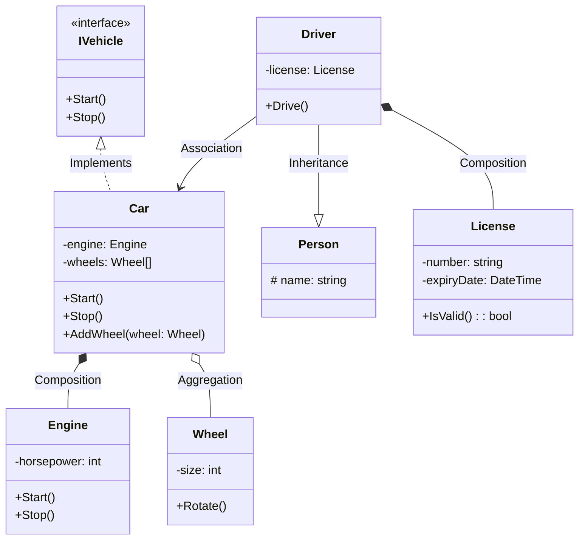

```mermaid
classDiagram
    class IVehicle {
        <<interface>>
        +Start()
        +Stop()
    }

    class Car {
        -engine: Engine
        -wheels: Wheel[]
        +Start()
        +Stop()
        +AddWheel(wheel: Wheel)
    }

    class Engine {
        -horsepower: int
        +Start()
        +Stop()
    }

    class Wheel {
        -size: int
        +Rotate()
    }

    class Person {
        # name: string
    }

    class Driver {
        -license: License
        +Drive()
    }

    class License {
        -number: string
        -expiryDate: DateTime
        +IsValid(): bool
    }

    IVehicle <|.. Car : Implements
    Car *-- Engine : Composition
    Car o-- Wheel : Aggregation
    Driver --> Car : Association
    Driver --|> Person : Inheritance
    Driver *-- License : Composition
```